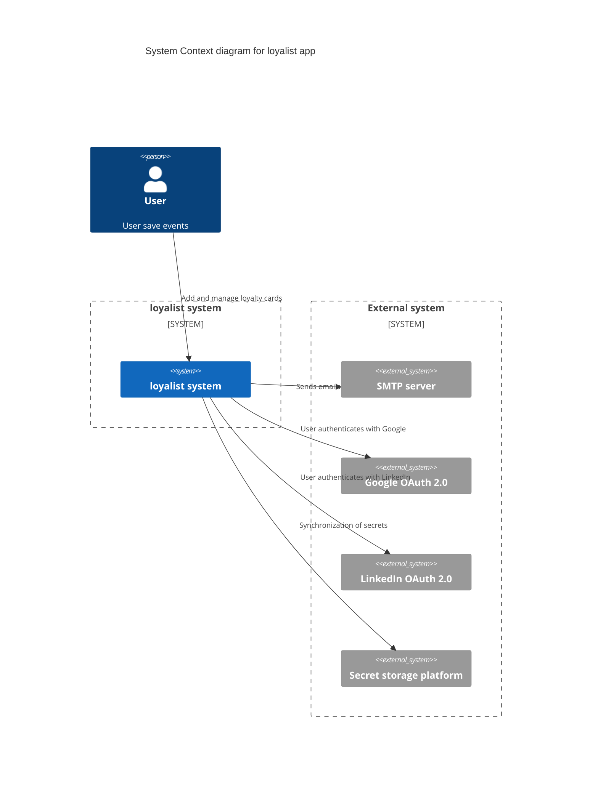

```mermaid
C4Context
      title System Context diagram for loyalist app
      Person(user, "User", "User save events")
      System_Boundary(loyalist-boundary, "loyalist  system") {
        Rel(user,loyalist, "Add and manage loyalty cards")
        System(loyalist, "loyalist system")
      }
      System_Boundary(external, "External system"){
      System_Ext(smtp, "SMTP server")
      System_Ext(Google, "Google OAuth 2.0")
      System_Ext(LinkedIn, "LinkedIn OAuth 2.0")
      System_Ext(infisical, "Secret storage platform")
      }
      Rel(loyalist, smtp, "Sends emails")
      Rel(loyalist, LinkedIn, "User authenticates with LinkedIn")
      Rel(loyalist, Google, "User authenticates with Google")
      Rel(loyalist, infisical, "Synchronization of secrets")
      UpdateLayoutConfig($c4ShapeInRow="4", $c4BoundaryInRow="2")
```
